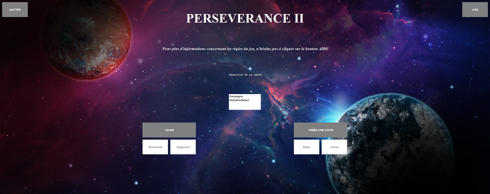

- [EN](#rules)
- [FR](#regles)

-----------------------

# RULES 📖 
After the success of the Mars 2020 PERSEVERANCE rover,
humanity has decided to send a rover to an promising exoplanet: **PERSEVERANCE II**.

The best technician to control it is put on the spot, it's **you** !

The arrival of the future colonists depends on the success of this mission.

The objective is to discover if the essential elements for life to exist are present on this new planet.

## EXPLORATION 🧭

During the adventures of the robot, you will have to direct its movements to explore the planet by clicking on the surrounding boxes. You will then discover many exotic landscapes. You'll find seascapes, deserts, mountains, snow, and flat lands.

As you can imagine, exploration will be difficult, quicksand slows you down, and seas and rivers seem impassable, as do mountains.

In addition, you will have to be careful with the terrain and avoid chasms and ravines!

## MISSIONS AND MANAGEMENT OF THE **Rover** 🤖
In order to check if the planet is habitable, you have to make sure that the __elements essential for life__ (ores and bacteria) are present on the planet, and you will have to __cross__ at least __70% of the map__.

A control panel is visible and gives you access to vital information for the robot.
CONTROL PANEL](doc/control_panel.png "Control Panel")

The progress of your objectives will be available in the **MISSIONS** menu.
MISSIONS](doc/missions.png "Missions")

But to complete these objectives, be sure not to suffer the perils of exploration 💀 If the *battery goes down 🔋 or if 
*too many components are defective* 🔧, you will lose contact with the rover!
-> In the **DETAILS** menu, it will be possible to follow the evolution of the game and the state of the robot.

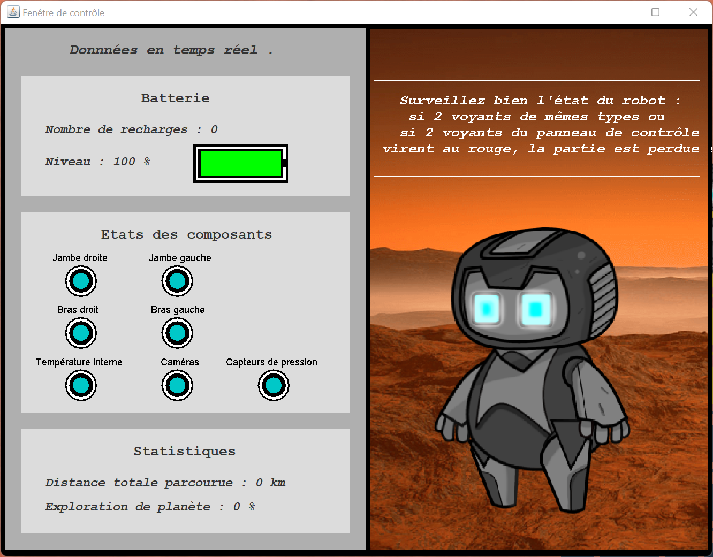

To guide you, you will have access to a minimap in the upper right corner of the window:

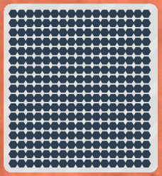

## MAINTENANCE AND OBJECTS
Don't worry! You will get some help!

In the rover's original capsule, we've loaded boxes of robotic components and spare batteries, as well as tracks for climbing mountains, and self-folding bridges.

But they seem to have deteriorated as the capsule approached the planet ... and all this equipment was scattered across the map. Find them quickly if you want to maintain contact with the robot!

## Symbols
Bacteria, ores, tools and supply boxes are present on the map in the form of question marks '?'.

To find out what symbol is hidden behind these '?', you will have to scan them with the Scan tool, then use the grapple to extract them. 

SCAN 1](doc/scan_1.png "Question mark symbols")

These two tools are available on the left side of the game window.

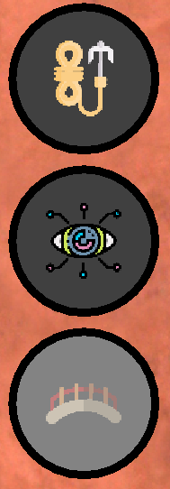

It won't be easy to use these skills though, so concentrate when using them!
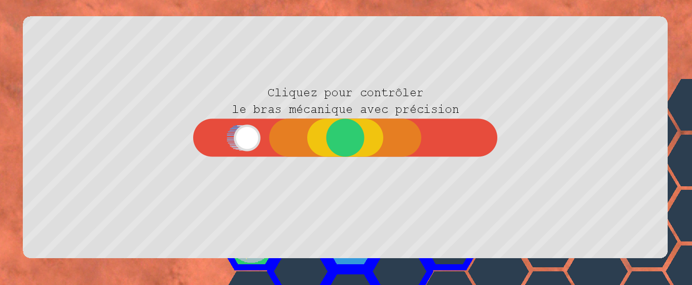
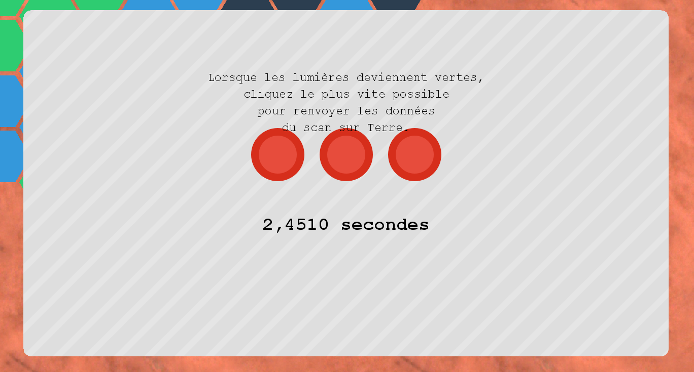
You can create bridges after extracting wood:
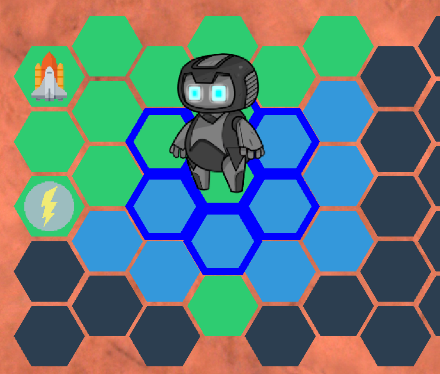
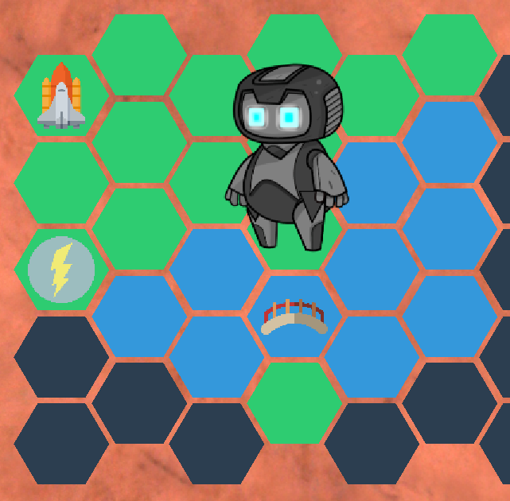

# Features
After discovering the game, you can create your own map!
In the main menu, click on the 'Create' button:
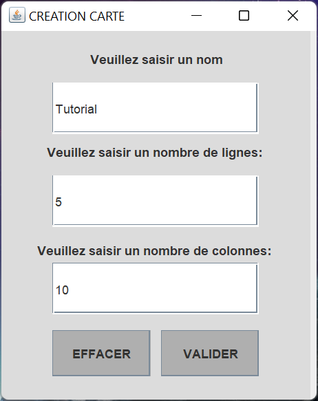

Then select the created map, and click on the 'Edit' button:

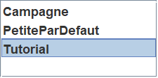

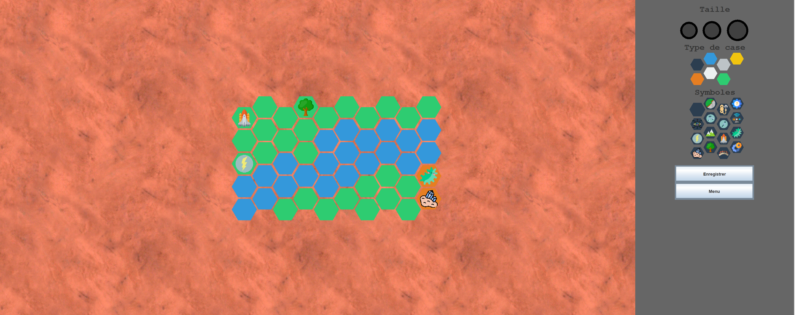
The rocket symbol is the player's point of appearance.

# NOTES TO DEVELOPERS
The coordinates of the map tiles are defined as follows:
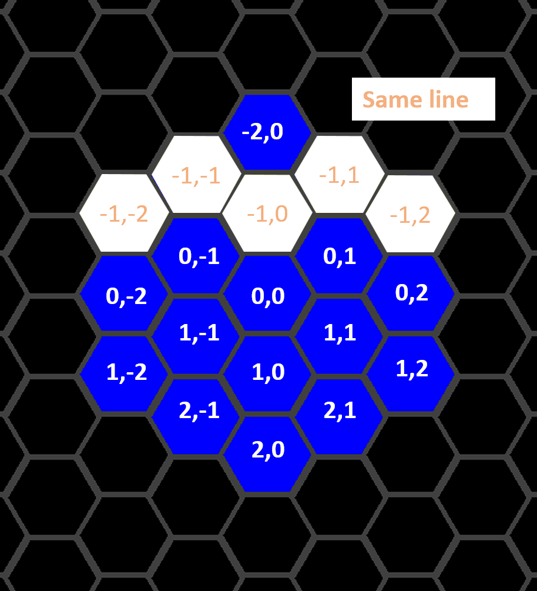

To import maps, place the file myMap.csv in the 'maps' folder at the same level as the .jar executable.

# CREDITS
Robot icon by Victor Ivlichev

-----------------------

# RÈGLES 📖 
Après le succès du robot PERSEVERANCE sur Mars,
l'humanité a décidé d'envoyer un rover sur une exoplanète prometteuse: **PERSEVERANCE II**.

Le meilleur technicien pour le contrôler est mis sur le coup, c'est **vous** !

L'arrivée des futurs colons dépend de la réussite de cette mission.

L'objectif est de découvrir si les éléments indispensable sà la vie sont présents sur cette nouvelle planète.

## EXPLORATION 🧭

Au cours des aventures du robot, vous allez devoir diriger ses déplacements pour explroer la planète en cliquant sur les cases alentour. Vous découvrirez alors moultes paysages exotiques. Vous reocnna^tirez des paysages marins, désertiques, montagneux, enneigés, ou encore des terrains plats.

Comme vous vous en doutez, l'exploration sera difficile, les sables mouvants vous ralentissent, et les mers et cours d'eau _semblent_ infranchissables, tout comme les montagnes.

De plus, vous devrez faire attention au relief et éviter les gouffres et ravins !

## MISSIONS ET GESTION DU **Rover** 🤖
Afin de vérifier si la planète est habitable, vous devez vous assurer que les __éléments indispensables à la vie__ (minerais et bactéries) sont présents sur la planète, et vous devrez __parcourir__ au moins __70% de la carte__.

Un panneau de contrôle est visible et donne accès aux informations vitales pour le robot.
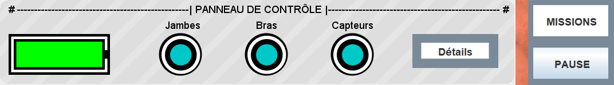

Les états de progression de ces objectifs seront disponibles dans le menu **MISSIONS**.
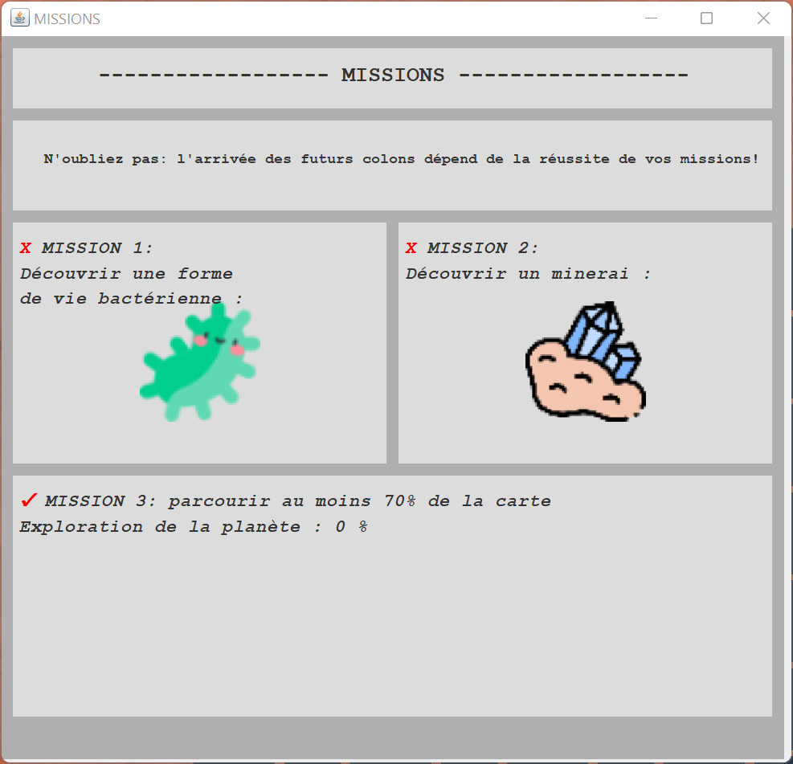

Mais pour remplir ces objectifs, veillez bien à ne pas souffrir des périls de l'exploration 💀 Si la *batterie tombe en rade* 🔋 ou si 
*trop de composants sont déféctueux* 🔧, vous perdrez le contact avec le rover !
-> Dans le menu **DÉTAILS**, il sera possible de suivre l'évolution de la partie et de l'état du robot.

Pour vous guider, vous aurez accès à une minicarte dans le coin supérieur droit de le la fenêtre:

## MAINTENANCE ET OBJETS
Rassurez-vous ! Vous allez bénéficier d'un peu d'aide !

Dans la capsule d'origine du rover, nous avons chargé des caisses de composants robotiques et des batteries de rechange, ainsi que des chenilles pour escalader les montagnes, et des ponts auto-dépliables.

Mais ils emble que la capsule se soit détériorée à l'approche de l'expoplanète ... et tous ces équipements se sont éparpillés sur la carte. Retrouvez-les vite si vous voulez maintenir le contact avec le robot !

## Symboles
Les sources de vie bactériennes, minerais, objets et caisses de ravitaillements sont présents sur la carte sous la forme de points d'interrogation '?'.

Pour découvrir quel symbole se cache derrière ces '?', vous allez devoir les scanner à l'aide de l'outil Scanner, puis utiliser le grappin pour les extraire. 

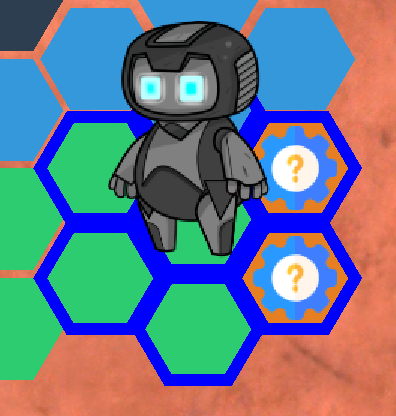

Ces deux outils sont disponibles sur la gauche de la fenêtre du jeu.

Ce ne sera néanmoins pas facile d'utiliser ces compétences, alors concentrez-vous pour les utiliser !

Vous pouvez notamment créer des ponts après avoir extrait du bois:

# Fonctionnalités
Après avoir découvert le jeu, vous pouvez créer votre propre carte !
Dans le menu principal, cliquez sur le bouton 'Créer':

Séléctionnez ensuite la carte créée, et cliquez sur le bouton 'Editer':

Le symbole de fusée est le point d'apparition du joueur.

# NOTES AU DÉVELOPPEURS
Les coordonnées des cases de la carte sont définies de la manière suivante:

Pour importer des cartes, placez le fichier maCarte.csv dans le dossier 'cartes' au même niveau que l'exécutable .jar.

# CRÉDITS
Icône de Robot par Victor Ivlichev
